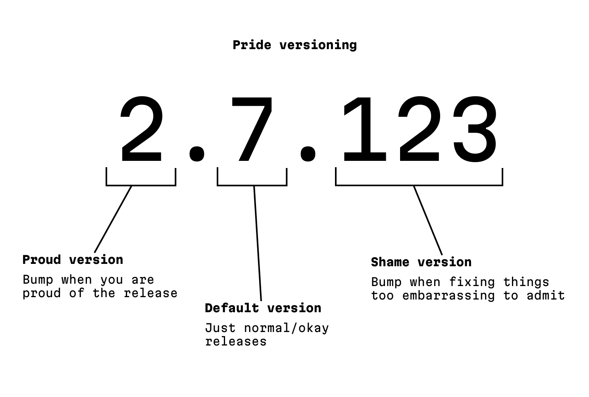

# General Information

## Future of the project
switching the main functionality from a GUI based Spotify Player to a (maybe Player independent) Music Analyzer and User/Mood tailored Playlist generation using Machine Learning

## Installation

* Need to have:
  * Spotify Premium
  * usable Internet Connection 
  * Needed Host Packages: geckodriver
1) create Spotify App ([https://developer.spotify.com/documentation/web-api/concepts/apps](https://developer.spotify.com/documentation/web-api/concepts/apps))
2) copy 'Client ID', 'Client secret' and 'Redirect URI'
3) create '.env'-file in project directory and import correctly in spotify_access.py
4) run SpotipyApp.py for GUI

## Lessons Learned

* don't overwrite attributes in the initializer with None to declare their type \
or update only half of the attributes
* Read Docs
* due to CEST and CET the datetime.datetime method can have an offset
* don't cross-reference anything (e.g. imports, classes) -> Circular Imports  \
-> big problems (max recursion depth; IDE be like: ╰（‵□′）╯)
  * instead move classes/structs to shared file as dataclasses to resolve circular import errors
* quotation marks '...' within Strings "..." are important
* if a list is required, enter a list
* though Playlist have markets don't use them
* catching exceptions can be a helpful but uncommon benefit
* superclasses can be profitable, but hurt the code readability 
* added separate changes.md file to better track changes
* do not reset Database before Analyzing anything (No Data in DB -> no Data for Analysis)
* you wont get an error (or smth. similar) if you cross the API request limit (for each request the delay grows exponentially)
* if current Spotify (API) Session/cookie is invalid delete `.spotify_cache`-file and retry
* spotipy is a shitty library no documentation -> if it is bad do it yourself but better

## Code/Comment Highlighting in Pycharm
- **BUG:**
  - Usage: Used to mark known bugs in the code.
  - Pattern: `\bbug\b.*`
  - Main Color (Light Red): `#FF6F61`
  - Darker Version: `#E65B4F`
- **DEBUGGING:**
  - Usage: Used to mark code that is used for debugging purposes.
  - Pattern: `<--- .*\bdebugging\b --->.*`
  - Main Color (Orange): `#FFA500`
  - Darker Version: `#E69500`
- **FIXME:**
  - Usage: Used to highlight code that needs fixing.
  - Pattern: `\bfixme\b.*`
  - Main Color (Light Red): `#FF6F61`
  - Darker Version: `#E65B4F`
- **HACK:**
  - Usage: Used to mark code that is a workaround or temporary solution.
  - Pattern: `\bhack\b.*`
  - Main Color (Purple): `#9370DB`
  - Darker Version: `#7D60BF`
- **IDEA:**
  - Usage: Used to denote an idea or suggestion for the code.
  - Pattern: `\bidea\b.*`
  - Main Color (Light Yellow): `#FFD700`
  - Darker Version: `#E6BE00`
- **Method Progress Status:**
  - Usage: Used to mark the development progress of methods (see below)
  - Pattern: `# \bmps\b.*`
  - Main Color (Pink): `#FF00FF`
  - Darker Version: `#E457E4`
- **NOTE:**
  - Usage: Used to add notes or explanations about the code.
  - Pattern: `\bnote\b.*`
  - Main Color (Light Blue): `#ADD8E6`
  - Darker Version: `#93C2CF`
- **TODO:**
  - Usage: Used to mark tasks that need to be done.
  - Pattern: `\btodo\b.*`
  - Main Color (Light Green): `#A4C639`
  - Darker Version: `#8CAF2D`
- **WARNING:**
  - Usage: Used to indicate something that might need attention or could be problematic.
  - Pattern: `\bwarning\b.*`
  - Main Color (Orange): `#FFA500`
  - Darker Version: `#E69500`

## Own Terminology/Abbreviations
- **IR Loop:** infinite recursion loop

### Method Progress Status (M.P.S., or mps)
- 0 -- planned, not implemented
- 1 -- implemented, not tested
- 2 -- in testing/debugging
- 3 -- finished

### Progress Versioning Semantic

by Niki Tonsky (https://mastodon.online/@nikitonsky/113691789641950263)

## Known Error messages

* requests.exceptions.ConnectionError: ('Connection aborted.', RemoteDisconnected('Remote end closed connection without response')) -> Just retry

## ToDo List (prioritized)

* [ ] do ToDo's in Code
* [ ] test Code
* [ ] comment Code (including Highlightings) add Docstrings

### Backend related

* [ ] switch Spotify API from Spotipy (badly documented) to official Web-API (goodly documented) using [requests](https://docs.python-requests.org/en/latest/index.html)
  * new library in `spotify_web_api.py`
  * [ ] finish `spotify_web_api.py`
  * [ ] remove spotipy Web API calls and replace with spotify_web_api.py  
* [ ] Error handling
* [ ] finish analysis.py
* [ ] optimize track search distribution in 'random_playlist_by_genre()'
* [ ] connect app with Home Assistant
* [ ] use Spotify's Audio Features & Analytics

### Frontend related

* [ ] fix progressbar
* [ ] add functionality to searched instance
* [ ] make possible that the Apps starts though Spotify is neither started nor playing anything \
(Classes->Player->get_instance())
* [ ] open extra Profile Window for Album, Artist, Playlist, User
* [ ] too long texts should move automatically
* [ ] QT GUI/better Frontend
* [ ] if searched track is already in queue, show/highlighted where (App Window)

## Tags
- Dictionaries / JSON
- SQLite

## Documentations

### APIs

* [Spotify for Developers](https://developer.spotify.com/)
* [Spotipy](https://spotipy.readthedocs.io/en/2.22.1/)
* [Chosic.com](https://www.chosic.com/spotify-playlist-analyzer/) (indirectly)

### Backend 

* [SQLite for Python](https://www.sqlitetutorial.net/sqlite-python/)
* [K-NN Algorithm](https://www.geeksforgeeks.org/k-nearest-neighbours/)

### Frontend

* [Tkinter](https://docs.python.org/3/library/tkinter.html)
* [QT for Python (PySide6)](https://doc.qt.io/qtforpython-6/PySide6/QtWidgets/index.html)

### Other

* [Markdown](https://www.markdownguide.org/basic-syntax/)
* [Docstring Conventions](https://peps.python.org/pep-0257/)
